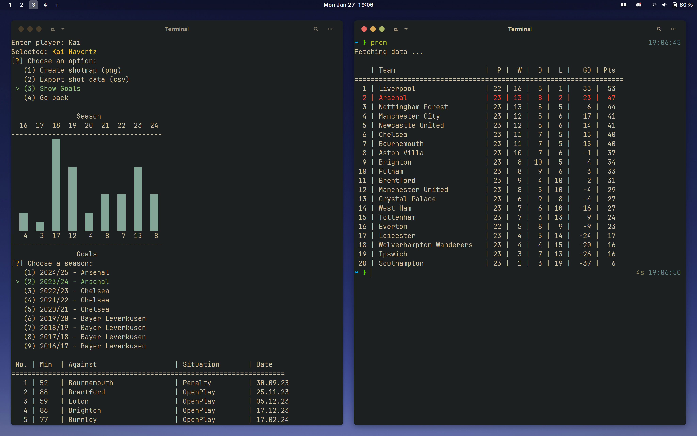

# cli football analysis [WIP]
This simple tool allows you to check on your favorite teams and players inside the terminal. Made with python and sqlite.

In this way you can quickly check the latest results, league tables, top scorers, et cetera. 

If you have a particular football club you like to follow, I recommend setting up a shortcut in your .zshrc or .bashrc file. This way you can quickly check on your favorite team by typing a simple command in the terminal.

I for example have the following alias in my zshrc file:

```bash
alias prem=prem='python3 ~/path/query_fav.py "EPL" "Arsenal"'
```
Which prints the league table with Arsenal highlighted in the terminal.

Currently the top 4 leagues in Europe are supported and can be passed to the query_fav.py script with these keywords:
```EPL, La_liga, Bundesliga, Serie_a```

A preview of the program:


It is still a WIP...
